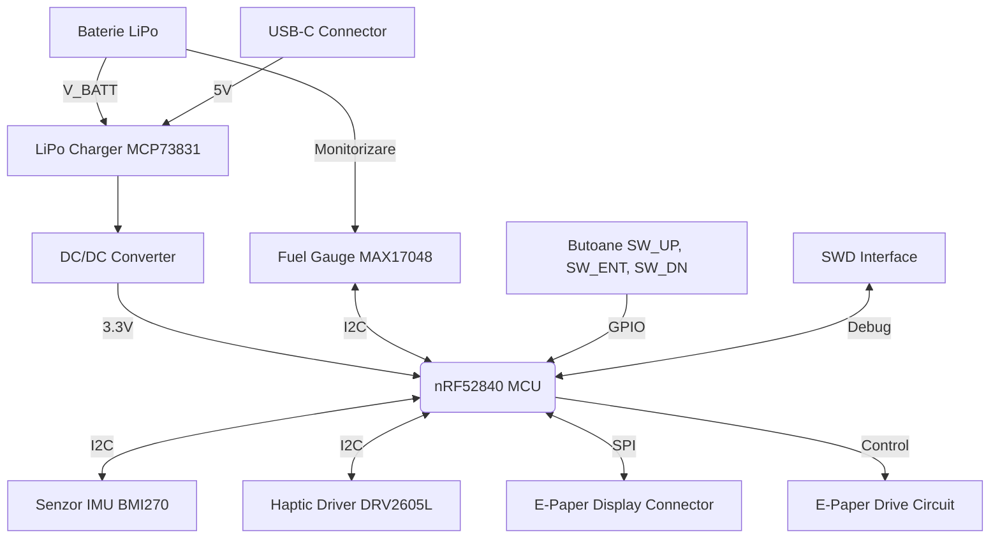

## 1. Diagrama bloc

Mai jos este diagrama bloc a sistemului, ilustrand modul in care componentele interactioneaza cu unitatea centrala (MCU):

## 2. Bill of Materials

| Componenta / Modul | Rol in proiect | Cod piesa JLCPCB |
|-------------------|----------------|------------------|
| nRF52840 | Microcontroler cu Bluetooth LE | C138981 |
| MAX17048G+T10 | Fuel Gauge (monitorizare baterie) | C149814 |
| BMI270 | IMU 6 axe (accelerometru + giroscop) | C2828345 |
| DRV2605L | Driver haptic (LRA/ERM) | C78152 |
| MCP73831T-2ACI/OT | Incarcator LiPo | C14434 |
| TPD4E05U06DQNR | Protectie ESD (USB-C) | C127411 |

## 3. Functionalitate Hardware

InkTime este construit ca un sistem modular eficient energetic:

### Microcontroller (MCU)
- nRF52840 (ARM Cortex-M4F)
- Bluetooth 5 integrat
- Conectivitate directa cu smartphone

### Alimentare si Incarcare
- Incarcare prin USB-C
- Incarcator dedicat LiPo (MCP73831)
- Protectie ESD integrata
- Monitorizare baterie prin MAX17048:
  - Masoara tensiunea
  - Estimeaza procentul bateriei
  - Consum foarte redus

### Afisaj E-Paper
- Conector FPC cu 24 pini
- Circuit dedicat de drive:
  - MOSFET-uri
  - Retea de condensatori
- Genereaza tensiuni pozitive si negative necesare refresh-ului

### Interfata Utilizator
- 3 butoane:
  - SW_UP
  - SW_ENT
  - SW_DN
- Debouncing hardware
- Feedback haptic:
  - Driver DRV2605L
  - Motor vibratii (LRA/ERM)
- IMU pentru detectarea miscarii mainii

## 4. Mapare pini (Pinout nRF52840)
| Periferic       | Semnal                 | Pin MCU                       | Descriere                        |
| --------------- | ---------------------- | ----------------------------- | -------------------------------- |
| I2C Bus         | SDA / SCL              | P0.26 / P0.27                 | Magistrala comuna pentru senzori |
| E-Paper SPI     | SCK / MOSI             | P0.17 / P0.20                 | Transfer rapid de date           |
| E-Paper Control | CS / DC / RST / BUSY   | P0.22 / P0.24 / P0.15 / P0.13 | Control display                  |
| Butoane         | SW_UP / SW_ENT / SW_DN | P0.06 / P0.08 / P0.12         | Input cu intreruperi             |
| Haptic          | EN / IN                | P0.05                         | Activare driver haptic           |
| USB Sense       | VBUS                   | P0.02                         | Detectare cablu USB              |

## 5. Design Log & Review
- Placa pe 2 straturi
- Forma ergonomica adaptata carcasei
- Plan de masa optimizat pentru:
stabilitate RF
performanta Bluetooth
- Grosime minimizata
- Layout compact
- Integrare eficienta
